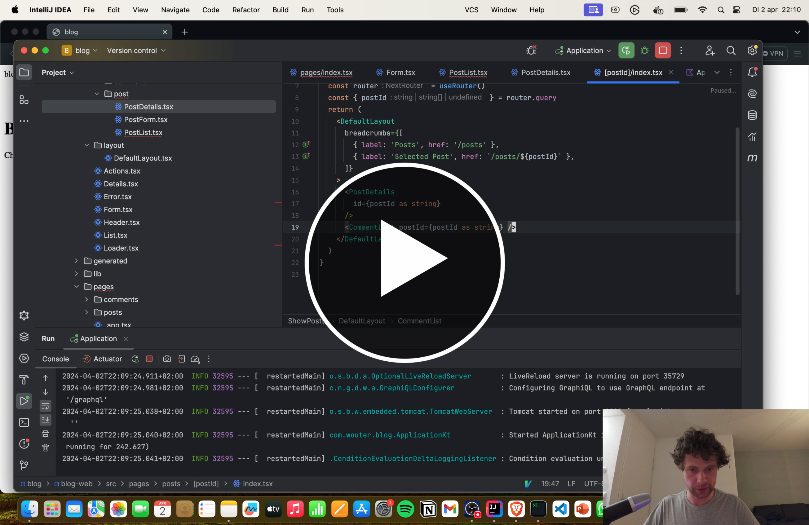

# Welcome to Basecode!

We are very excited to have you here!

Basecode is a full-stack platform for creating web apps. The platform consists of several generators to generate the
basic structure of your web application.

(Code generated by) Basecode is:

- **Productive**, as it allows you to generate authentication and CRUD functionality with 1-N relations, including
  migrations, GraphQL schema files, unit tests and integration tests.
- **Maintainable**, as it provides a package-by-feature structuring approach, GraphQL communication and domain events
  between different aggregates, so you get a highly decoupled and extensible architecture.
- **Incremental**, as it allows you to start with almost no code. Then, once you're ready for the next step, add
  scaffolds, authentication, a frontend and more at your own pace.

Basecode generates code consisting of:

- Java / Kotlin
- GraphQL schema files
- Typescript + React (through Next.js)

Finally, Basecode is open source ([MIT](LICENSE.md)).

⭐ If you like Basecode, please consider giving it a star. Your support can help the project grow and deliver exciting
features.

<a href="https://www.youtube.com/watch?v=rx9xL0nhot8"></a>

## Installation

In order to use Basecode, make sure you have the following software installed:

- Go 1.16 or later
- JDK 21 or later
- Node 18 or later
- Docker

You can install Basecode using the following command:

```shell
go install github.com/wnederhof/basecode/cmd/basecode@latest
```

## Usage

For each of the following commands (except for `new`), you can use `-o` to allow overwriting existing files and `-d` to
delete the specified set of files. Note that the flags go after `generate`.

For example: `basecode generate -o scaffold Post title contents:string`

### Create a New Project

To create a new project, simply type:

```
basecode new <groupId> <artifactId>
```

Here, `groupId` and `artifactId` are the name of the group and artifact respectively, as defined by Maven.

For example:

```
basecode new com.example blog
```

By default, this will create a Kotlin + React project. However, Basecode can generate Java code by specifying `--backend java`. For example:

```
basecode new --backend java com.example blog
```

### Scaffold Generation

Using `basecode generate`, you can generate code based using one of the following generators.

```
   backend:scaffold, bes   Backend Scaffold
   backend:model, bem      Model files, including migration script, entity and repository
   backend:api, bea        GraphQL API (schema and resolvers)
   backend:service, bsv    Service between API and repository
   frontend, fe            Frontend Support
   frontend:scaffold, fes  Frontend Scaffold (Generate frontend support first)
   scaffold, s             Backend and Frontend Scaffold (Generate frontend support first)
   backend:auth, ba        Backend Authentication
   frontend:auth, fa       Frontend Authentication
   auth, a                 Authentication
```

For more information about the generators, run:

```
basecode generate <generator name> -h
```

For example:

```
basecode generate scaffold -h
```

In most cases, you will want to use `scaffold`. This generator takes a model name and a list of field names and types
and will generate backend and frontend code for the model you specified. For example:

```
basecode generate scaffold Post title:string description:text
```

Available types:

- string
- int
- text
- date
- datetime
- boolean

# Starting the program

In order to start your newly generated program, you need to:

- Run `docker-compose up` in the `<artifactId>-server` directory to start up a local database
- Run `./mvnw spring-boot:run` in the `<artifactId>-server` server to start the backend (or launch the Application in
  your IDE)
- Run `npm install` in the `<artifactId>-web` directory to install the frontend dependencies
- Run `npm dev` in the `<artifactId>-web` directory to start the frontend development server

## Tips

- If you want to *update* an existing scaffolding, make start with an empty commit. This way, you can easily see
  overwrite existing code using the `-o` (overwrite) flag and use the Git diff to determine what code you want to keep
  and what code you want to overwrite.

## Resources

- [Discord Channel](https://discord.gg/KgcYdpEZ)
- [WireQuery](https://github.com/wirequery/wirequery) - A real world app created using Basecode

## Credits

- The `new` template is based on the code generated using Spring Boot Initializr.
- The `react-frontend` template is mostly based on https://github.com/sanjaytwisk/nextjs-ts.
